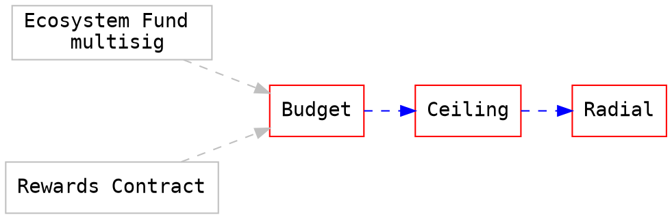

# Centrifuge Radial Token
## Token Functionality
The Radial token is an ERC20 token that behaves according to the [ERC20 standard](https://eips.ethereum.org/EIPS/eip-20).

### Fixed limit on supply
The supply of the Radial token is dynamic, not all of it's supply will be minted at creation however the contract enforces that the fixed supply of 1 Billion can never be exceeded.

### Burn
Any token owner can choose to burn part of their token balance. This will allow more tokens to be minted by an authorized party.

### Minting Tokens with Budgets
The only way tokens can be minted is by having the administrator give an address a budget. When calling the mint method, the contract checks if the address has the required budget and subtracts the amount of tokens minted from that budget. Any contract with a budget can directly mint a token balance into a specified address until all their budget is used up. At launch this is a multisig contract but will eventually be replaced with a more sophisticated governance mechanism.


## Architecture
This is heavily inspired by DappHub the contracts taking their learnings from years of solidity development and architecture considerations for enabling simpler formal verification of the contract.

### ERC20 Token Functionality
The ERC20 token functionality for the Radial token is copied from the [MakerDAO Dai ERC20 contract](https://github.com/makerdao/dss/blob/master/src/dai.sol) and no modifications have been made to this contract. All additional functionality implemented for the Radial token is done in two additional contracts that are authorized to mint token in the ERC20 contract (`src/radial.sol`).

### Ward
The concept of a ward is that a contract defines a single address that may interact with the contract. The ward can be changed only by the ward. This is a very flexible design that allows for further limiting the contracts or changing functionality by chaining different wards. The simplest implementation of a ward looks as follows:

```javascript
// See: https://github.com/makerdao/dss/blob/master/src/dai.sol#L19
contract Ward {
    mapping (address => uint) public wards;
    modifier auth { require(wards[msg.sender]); _; }
    function rely(address usr) public auth { wards[usr] = 1; }
    function deny(address usr) public auth { wards[usr] = 0; }
}
```

The ward has 3 methods:
1) Rely: adds an address to the list of wards
2) Deny: removes an address to the list of wards
3) Auth: a modifier that checks that msg.sender is a ward

### Layered Small Simple Contracts
Smaller contracts that have specific features allow for a more flexible design that is easier to verify and audit.





## Contracts
### Radial
The `Radial` contract should be a standard conform ERC20 contract. In addition to implementing all standard ERC20 methods & events, it implements the `Ward` pattern and has a mint method. This is a copy of the MakerDAO Dai token contract.

### Ceiling
The `Ceiling` is the first ward, it's only purpose is to verify that any call to mint() would not result in the token available supply to surpass the limit that is hardcoded in the `Ceiling` contract.

### Budget
The Budget contract keeps track of addresses and number of tokens they are allowed to mint. A ward can set the budget per address and any address with a budget can call `mint`.

## Formal Verification
The contracts in this repository are formally verified against the spec defined in github.com/centrifuge/k-radial. The `k-radial` repository contains the specifications that define the behavior of the token as well as instructions on how to verify them.
