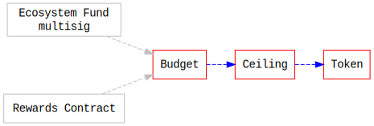
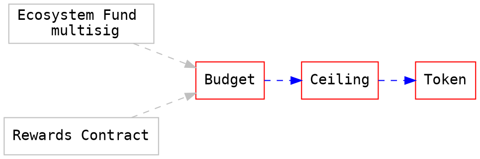

# Centrifuge Token
## Architecture
This is heavily inspired by DappHub the contracts taking their learnings from years of solidity development and architecture considerations for enabling simpler formal verification of the contract.

### Ward
The concept of a ward is that a contract defines a single address that may interact with the contract. The ward can be changed only by the ward. This is a very flexible design that allows for further limiting the contracts or changing functionality by chaining different wards. The simplest implementation of a ward looks as follows: 

```javascript
// See: https://github.com/makerdao/dss/blob/master/src/dai.sol#L19
contract Ward {
    mapping (address => uint) public wards;
    modifier auth { require(wards[msg.sender]); _; }
    function rely(address guy) public auth { wards[guy] = 1; }
    function deny(address guy) public auth { wards[guy] = 0; } 
}
```

The ward has 3 methods:
1) Rely: adds an address to the list of wards
2) Deny: removes an address to the list of wards
3) Auth: a modifier that checks that msg.sender is a ward

### Layered Small Simple Contracts 
Smaller contracts that have specific features allow for a more flexible design that is easier to verify and audit.





## Contracts
### Token
The `Token` contract should be a standard conform ERC20 contract. In addition to implementing all standard ERC20 methods & events, it implements the `Ward` pattern and has a mint method. This is mostly a copy of the MakerDAO Dai token contract.

### Ceiling 
The `Ceiling` is the first ward, it's only purpose is to verify that any call to mint() would not result in the token available supply to surpass the limit that is hardcoded in the `Ceiling` contract.

### Budget
The Budget contract keeps track of addresses and number of tokens they are allowed to mint. A ward can set the budget per address and any address with a budget can call `mint`.

